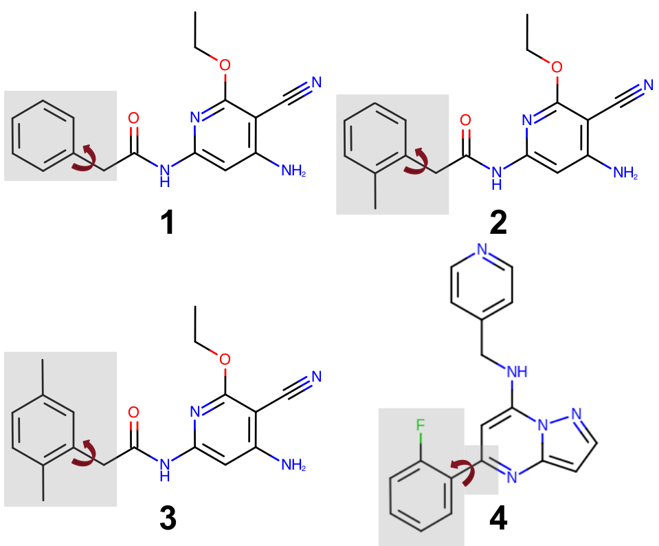

# blues-flexible-ligand
This directory (and its subdirectories) provides the input files for running and analyzing the simulations reported in the paper "Sampling conformational changes of bound ligands using Nonequilibrium Candidate Monte Carlo".

## Contents

- [`ligand1`](ligand1): directory containing input files for running simulations with ligand 1.
- [`ligand2`](ligand2): directory containing input files for running simulations with ligand 2.
- [`ligand3`](ligand3): directory containing input files for running simulations with ligand 3.
- [`ligand4`](ligand4): directory containing input files for running simulations with ligand 4.
- [`plots_paper`](plots_paper): directory containing matlab scripts used to generate plots for the paper. The name of the scripts contain the figure number it was used for.
- [`scripts`](scripts): directory containing scripts and Amber input files used to run and post-process MD and MD/NCMC simulations.
- [`blues-master.tgz`](blues-master.tgz): BLUES code used for running MD/NCMC simulations.
